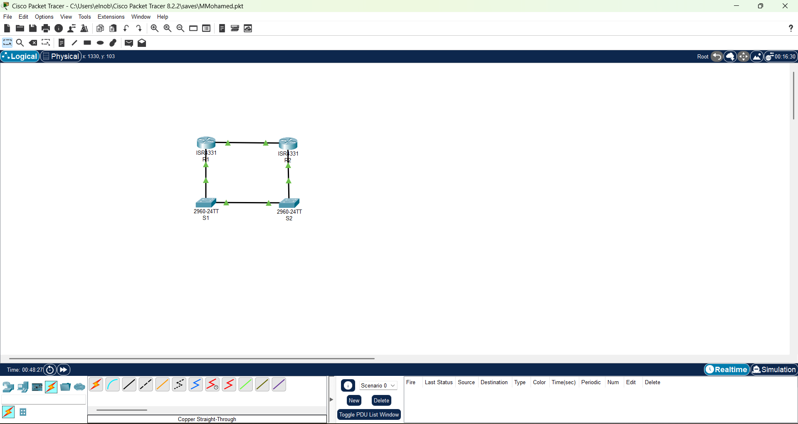
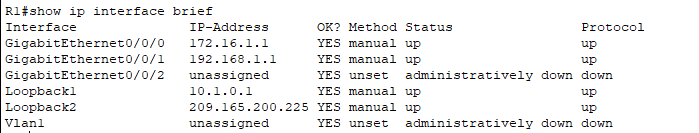
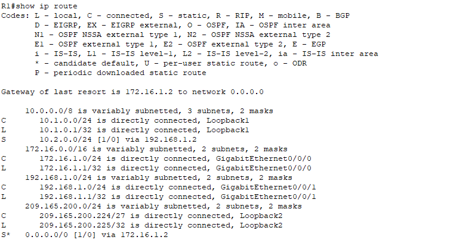
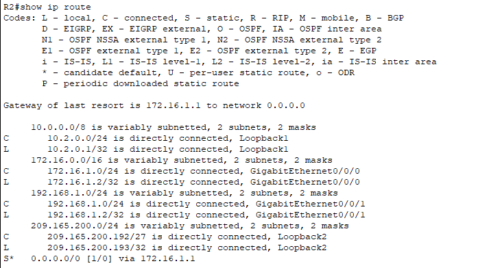
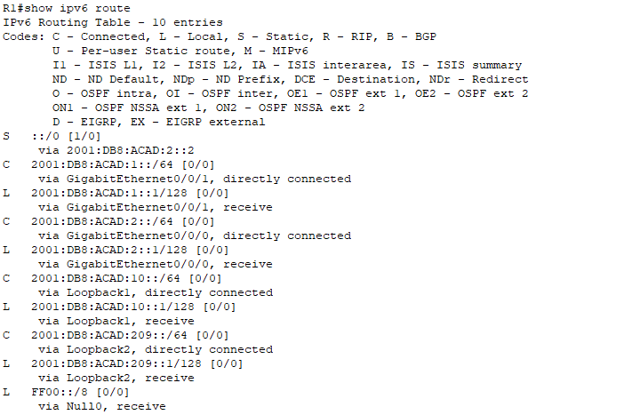
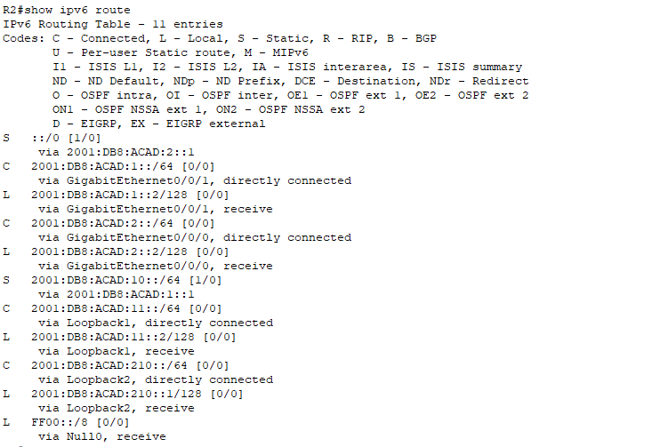
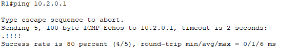
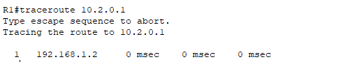
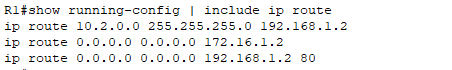
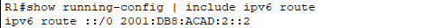

# Lab 02 - Configure IPv4 and IPv6 Static and Default Routes

## 🎯 Lab Objectives

By completing this lab, I demonstrated the ability to:
- ✅ Configure IPv4 static routes between routers
- ✅ Configure IPv6 static routes in a dual-stack environment
- ✅ Implement default routes for internet connectivity
- ✅ Configure floating static routes for redundancy
- ✅ Verify routing tables and end-to-end connectivity
- ✅ Understand routing path selection and administrative distance
- ✅ Troubleshoot routing issues using show commands

**Difficulty:** ⭐⭐⭐ Intermediate  
**Time Required:** 2-3 hours  
**CCNA Exam Topics:** 3.1, 3.2 (Static routing, IPv6 addressing, routing fundamentals)

---

## 🖼️ Network Topology



### Device List:
- **R1** - Edge Router (ISR4331) - Connects to simulated Internet and R2
- **R2** - Core Router (ISR4331) - Connects to R1 and simulated networks
- **S1** - Switch (2960) - Connected to R1
- **S2** - Switch (2960) - Connected to R2

### Network Design:
This lab uses **loopback interfaces** to simulate multiple networks without needing additional physical devices. Loopbacks act as virtual networks for testing routing.

---

## 📋 IP Addressing Scheme

### IPv4 Networks

**Point-to-Point Links:**
| Link | Network | R1 Interface | R1 IP | R2 Interface | R2 IP |
|------|---------|--------------|-------|--------------|-------|
| Primary Link | 172.16.1.0/24 | G0/0/0 | 172.16.1.1 | G0/0/0 | 172.16.1.2 |
| Backup Link | 192.168.1.0/24 | G0/0/1 | 192.168.1.1 | G0/0/1 | 192.168.1.2 |

**Loopback Networks (Simulated):**
| Router | Loopback | Network | IP Address | Purpose |
|--------|----------|---------|------------|---------|
| R1 | Loopback1 | 10.1.0.0/24 | 10.1.0.1 | Simulates internal network |
| R1 | Loopback2 | 209.165.200.224/27 | 209.165.200.225 | Simulates Internet gateway |
| R2 | Loopback1 | 10.2.0.0/24 | 10.2.0.1 | Simulates internal network |
| R2 | Loopback2 | 209.165.200.192/27 | 209.165.200.193 | Simulates Internet gateway |

---

### IPv6 Networks

**Point-to-Point Links:**
| Link | Network | R1 Interface | R1 IP | R2 Interface | R2 IP |
|------|---------|--------------|-------|--------------|-------|
| Primary Link | 2001:DB8:ACAD:2::/64 | G0/0/0 | 2001:DB8:ACAD:2::1 | G0/0/0 | 2001:DB8:ACAD:2::2 |
| Backup Link | 2001:DB8:ACAD:1::/64 | G0/0/1 | 2001:DB8:ACAD:1::1 | G0/0/1 | 2001:DB8:ACAD:1::2 |

**Loopback Networks:**
| Router | Loopback | Network | IP Address |
|--------|----------|---------|------------|
| R1 | Loopback1 | 2001:DB8:ACAD:10::/64 | 2001:DB8:ACAD:10::1 |
| R1 | Loopback2 | 2001:DB8:ACAD:209::/64 | 2001:DB8:ACAD:209::1 |
| R2 | Loopback1 | 2001:DB8:ACAD:11::/64 | 2001:DB8:ACAD:11::2 |
| R2 | Loopback2 | 2001:DB8:ACAD:210::/64 | 2001:DB8:ACAD:210::1 |

---

## 🛠️ Routing Configuration Implemented

### What is Static Routing?

**Static routing** is manual configuration of routes by a network administrator. Unlike dynamic routing protocols (OSPF, EIGRP), static routes:
- Don't change automatically
- Have lower router overhead (no protocol messages)
- Are predictable and secure
- Require manual updates when topology changes

This lab demonstrates **three types of static routes:**
1. **Standard static route** - Routes to specific networks
2. **Default route** - Catch-all route for unknown destinations
3. **Floating static route** - Backup route with higher administrative distance

---

## ⚙️ Configuration Steps

### Step 1: Configure Router Interfaces

**R1 Interface Configuration:**

```cisco
R1(config)# interface GigabitEthernet0/0/0
R1(config-if)# ip address 172.16.1.1 255.255.255.0
R1(config-if)# ipv6 address FE80::1 link-local
R1(config-if)# ipv6 address 2001:DB8:ACAD:2::1/64
R1(config-if)# no shutdown

R1(config)# interface GigabitEthernet0/0/1
R1(config-if)# ip address 192.168.1.1 255.255.255.0
R1(config-if)# ipv6 address FE80::1 link-local
R1(config-if)# ipv6 address 2001:DB8:ACAD:1::1/64
R1(config-if)# no shutdown
```

**R2 Interface Configuration:**

```cisco
R2(config)# interface GigabitEthernet0/0/0
R2(config-if)# ip address 172.16.1.2 255.255.255.0
R2(config-if)# ipv6 address FE80::2 link-local
R2(config-if)# ipv6 address 2001:DB8:ACAD:2::2/64
R2(config-if)# no shutdown

R2(config)# interface GigabitEthernet0/0/1
R2(config-if)# ip address 192.168.1.2 255.255.255.0
R2(config-if)# ipv6 address FE80::2 link-local
R2(config-if)# ipv6 address 2001:DB8:ACAD:1::2/64
R2(config-if)# no shutdown
```

---

### Step 2: Configure Loopback Interfaces (Simulated Networks)

**R1 Loopbacks:**
```cisco
R1(config)# interface Loopback1
R1(config-if)# ip address 10.1.0.1 255.255.255.0
R1(config-if)# ipv6 address FE80::1 link-local
R1(config-if)# ipv6 address 2001:DB8:ACAD:10::1/64

R1(config)# interface Loopback2
R1(config-if)# ip address 209.165.200.225 255.255.255.224
R1(config-if)# ipv6 address FE80::1 link-local
R1(config-if)# ipv6 address 2001:DB8:ACAD:209::1/64
```

**R2 Loopbacks:**
```cisco
R2(config)# interface Loopback1
R2(config-if)# ip address 10.2.0.1 255.255.255.0
R2(config-if)# ipv6 address FE80::2 link-local
R2(config-if)# ipv6 address 2001:DB8:ACAD:11::2/64

R2(config)# interface Loopback2
R2(config-if)# ip address 209.165.200.193 255.255.255.224
R2(config-if)# ipv6 address FE80::2 link-local
R2(config-if)# ipv6 address 2001:DB8:ACAD:210::1/64
```

---

### Step 3: Configure IPv4 Static Routes

**R1 Static Routes:**

```cisco
! Static route to R2's internal network (10.2.0.0/24)
R1(config)# ip route 10.2.0.0 255.255.255.0 192.168.1.2

! Primary default route (via 172.16.1.2)
R1(config)# ip route 0.0.0.0 0.0.0.0 172.16.1.2

! Floating static route (backup default route with AD 80)
R1(config)# ip route 0.0.0.0 0.0.0.0 192.168.1.2 80
```

**Explanation:**
- **First route:** Tells R1 how to reach 10.2.0.0/24 network via 192.168.1.2
- **Second route:** Default route (0.0.0.0/0) for all unknown destinations via primary link
- **Third route:** Backup default route only used if primary fails (AD 80 > default AD 1)

**R2 Static Routes:**

```cisco
! Default route pointing back to R1
R2(config)# ip route 0.0.0.0 0.0.0.0 172.16.1.1
```

**Note:** R2 doesn't need a specific route to 10.1.0.0/24 because it has a default route pointing to R1.

---

### Step 4: Configure IPv6 Static Routes

**Enable IPv6 routing first:**
```cisco
R1(config)# ipv6 unicast-routing
R2(config)# ipv6 unicast-routing
```

**R1 IPv6 Routes:**
```cisco
! IPv6 default route
R1(config)# ipv6 route ::/0 2001:DB8:ACAD:2::2
```

**R2 IPv6 Routes:**
```cisco
! Static route to R1's IPv6 loopback network
R2(config)# ipv6 route 2001:DB8:ACAD:10::/64 2001:DB8:ACAD:1::1

! Primary IPv6 default route
R2(config)# ipv6 route ::/0 2001:DB8:ACAD:2::1

! Floating IPv6 default route (backup with AD 80)
R2(config)# ipv6 route ::/0 2001:DB8:ACAD:1::1 80
```

---

### Step 5: Save Configuration

```cisco
R1# write memory
R1# copy running-config startup-config

R2# write memory
R2# copy running-config startup-config
```

---

## ✅ Verification & Testing

### Verify Router Interfaces

**Check R1 interfaces are up:**
```cisco
R1# show ip interface brief
```

Expected output:
```
Interface              IP-Address      OK? Method Status                Protocol 
GigabitEthernet0/0/0   172.16.1.1      YES manual up                    up 
GigabitEthernet0/0/1   192.168.1.1     YES manual up                    up 
Loopback1              10.1.0.1        YES manual up                    up 
Loopback2              209.165.200.225 YES manual up                    up
```



---

### Verify IPv4 Routing Table

**R1 Routing Table:**
```cisco
R1# show ip route
```

Expected entries:
```
S    10.2.0.0/24 [1/0] via 192.168.1.2          (Static route to R2's network)
C    172.16.1.0/24 is directly connected, G0/0/0
C    192.168.1.0/24 is directly connected, G0/0/1
S*   0.0.0.0/0 [1/0] via 172.16.1.2             (Default route - primary)
     0.0.0.0/0 [80/0] via 192.168.1.2           (Floating static - backup)
```

**Key indicators:**
- **S** = Static route
- **S*** = Default route (static)
- **C** = Directly connected
- **[1/0]** = Administrative Distance 1, Metric 0
- **[80/0]** = Floating route with AD 80 (only used if primary fails)



**R2 Routing Table:**
```cisco
R2# show ip route
```



---

### Verify IPv6 Routing Table

**R1 IPv6 Routing:**
```cisco
R1# show ipv6 route
```

Expected:
```
S   ::/0 [1/0] via 2001:DB8:ACAD:2::2           (IPv6 default route)
C   2001:DB8:ACAD:2::/64 [0/0] via G0/0/0
C   2001:DB8:ACAD:1::/64 [0/0] via G0/0/1
L   2001:DB8:ACAD:10::1/128 [0/0] via Loopback1
```



**R2 IPv6 Routing:**
```cisco
R2# show ipv6 route
```



---

### Test IPv4 Connectivity

**From R1, ping R2's loopback:**
```cisco
R1# ping 10.2.0.1
```

Expected: ✅ Successful replies

```
Type escape sequence to abort.
Sending 5, 100-byte ICMP Echos to 10.2.0.1, timeout is 2 seconds:
!!!!!
Success rate is 100 percent (5/5), round-trip min/avg/max = 0/0/1 ms
```



---

### Test IPv6 Connectivity

**From R1, ping R2's IPv6 loopback:**
```cisco
R1# ping 2001:DB8:ACAD:11::2
```

Expected: ✅ Successful replies


---

### Verify Routing Path with Traceroute

**Trace route from R1 to R2's network:**
```cisco
R1# traceroute 10.2.0.1
```

Expected output:
```
Type escape sequence to abort.
Tracing the route to 10.2.0.1

  1 192.168.1.2 0 msec 0 msec 0 msec  (Reaches R2)
```



This confirms traffic flows through 192.168.1.2 (R2) to reach the destination.

---

### View Configured Static Routes

**Show only static routes on R1:**
```cisco
R1# show running-config | include ip route
```

Output:
```
ip route 10.2.0.0 255.255.255.0 192.168.1.2
ip route 0.0.0.0 0.0.0.0 172.16.1.2
ip route 0.0.0.0 0.0.0.0 192.168.1.2 80
```



**Show IPv6 routes:**
```cisco
R1# show running-config | include ipv6 route
```

Output:
```
ipv6 route ::/0 2001:DB8:ACAD:2::2
```



---

## 🐛 Troubleshooting

### Issue 1: Cannot Ping Remote Network

**Symptoms:** R1 cannot ping 10.2.0.1 (R2's loopback)

**Possible Causes:**
- Static route not configured
- Incorrect next-hop IP address
- Interface down
- No return route on R2

**Solution:**
```cisco
! Verify route exists
R1# show ip route 10.2.0.0

! Check next-hop is reachable
R1# ping 192.168.1.2

! Verify R2 has return route (default route pointing back)
R2# show ip route
```

---

### Issue 2: Floating Static Route Not Activating

**Symptoms:** Primary link fails but backup route doesn't take over

**Possible Causes:**
- Floating route not configured with higher AD
- Primary interface still showing "up" even though link failed
- No routing protocol to detect failure

**Solution:**
```cisco
! Verify floating route has higher AD
R1# show ip route 0.0.0.0

! Should show:
! S* 0.0.0.0/0 [1/0] via 172.16.1.2  (active)
!    0.0.0.0/0 [80/0] via 192.168.1.2 (standby)

! Manually shut down primary interface to test
R1(config)# interface g0/0/0
R1(config-if)# shutdown

! Verify backup route becomes active
R1# show ip route 0.0.0.0
! Should now show: S* 0.0.0.0/0 [80/0] via 192.168.1.2
```

---

### Issue 3: IPv6 Routing Not Working

**Symptoms:** IPv6 pings fail

**Possible Causes:**
- IPv6 routing not enabled
- Incorrect IPv6 route syntax
- Link-local addresses used incorrectly

**Solution:**
```cisco
! Verify IPv6 routing is enabled
R1# show running-config | include ipv6 unicast-routing
! Should show: ipv6 unicast-routing

! If not enabled:
R1(config)# ipv6 unicast-routing

! Verify IPv6 route
R1# show ipv6 route ::/0

! Test IPv6 connectivity
R1# ping 2001:DB8:ACAD:2::2
```

---

### Issue 4: Route in Table But Traffic Not Forwarding

**Symptoms:** Route exists in routing table, but pings fail

**Possible Causes:**
- Next-hop router doesn't have return route
- Interface issues
- Subnet mask mismatch

**Solution:**
```cisco
! On R1: Verify route
R1# show ip route 10.2.0.0

! On R2: Verify return route exists (default route or specific route back)
R2# show ip route 10.1.0.0
! Should see route back to R1's networks

! Check interface status
R1# show ip interface brief
R2# show ip interface brief
! All interfaces should show "up up"
```

---

## 💡 Key Concepts Learned

### 1. Types of Static Routes

**Standard Static Route:**
```cisco
ip route 10.2.0.0 255.255.255.0 192.168.1.2
```
- Routes to a specific network
- Always active if next-hop is reachable
- Administrative Distance: 1 (by default)

**Default Route (Gateway of Last Resort):**
```cisco
ip route 0.0.0.0 0.0.0.0 172.16.1.2
```
- Matches all destinations (0.0.0.0/0)
- Used when no specific route exists
- Typically points to ISP or Internet gateway
- Shows as `S*` in routing table

**Floating Static Route (Backup):**
```cisco
ip route 0.0.0.0 0.0.0.0 192.168.1.2 80
```
- Higher AD (80) than primary route (1)
- Only installed in routing table if primary fails
- Provides redundancy without routing protocol
- Common for backup internet connections

---

### 2. Administrative Distance (AD)

**AD determines which route is preferred when multiple routes to same destination exist:**

| Route Type | Default AD |
|------------|------------|
| Directly Connected | 0 |
| Static Route | 1 |
| EIGRP | 90 |
| OSPF | 110 |
| RIP | 120 |
| **Floating Static** | **Manually set (usually 80-254)** |

**Lower AD = More trustworthy = Preferred route**

In this lab:
- Primary default route: AD 1 (active)
- Floating default route: AD 80 (standby)

---

### 3. IPv4 vs IPv6 Static Route Syntax

**IPv4:**
```cisco
ip route <destination-network> <subnet-mask> <next-hop-ip> [AD]
ip route 10.2.0.0 255.255.255.0 192.168.1.2
```

**IPv6:**
```cisco
ipv6 route <destination-network/prefix> <next-hop-ipv6> [AD]
ipv6 route 2001:DB8:ACAD:10::/64 2001:DB8:ACAD:1::1
```

**Key Differences:**
- IPv6 uses prefix length (/64) instead of subnet mask
- IPv6 requires `ipv6 unicast-routing` to be enabled
- IPv6 next-hop can be link-local address (FE80::) or global unicast

---

### 4. Next-Hop vs Exit Interface

**Two ways to specify where to send traffic:**

**Next-Hop IP (Recommended):**
```cisco
ip route 10.2.0.0 255.255.255.0 192.168.1.2
```
- Specifies the IP address of the next router
- Router performs recursive lookup
- More common in modern networks

**Exit Interface:**
```cisco
ip route 10.2.0.0 255.255.255.0 GigabitEthernet0/0/1
```
- Specifies outgoing interface
- Used on point-to-point links
- Can cause issues on multi-access networks

**Best Practice:** Use next-hop IP for Ethernet links, exit interface for point-to-point serial links.

---

### 5. Why Use Loopback Interfaces?

**In this lab, loopbacks simulate multiple networks:**

**Advantages:**
- Always up (never goes down)
- No physical hardware needed
- Perfect for testing routing
- Simulates real networks cheaply

**Real-world uses:**
- Router ID for routing protocols (OSPF, BGP)
- Management interface (always reachable)
- Testing and simulation
- Endpoint for VPNs and tunnels

---

### 6. Routing Table Codes

**Understanding `show ip route` output:**

```
C - Connected (directly attached)
L - Local (interface IP itself)
S - Static route
S* - Static default route (candidate default)
D - EIGRP
O - OSPF
R - RIP
```

**Route format:**
```
S    10.2.0.0/24 [1/0] via 192.168.1.2
 ^        ^       ^ ^          ^
 |        |       | |          |
Code   Network   AD Metric  Next-hop
```

---

## 🎯 Real-World Applications

### Scenario 1: Branch Office to Headquarters

**Setup:**
- Branch office has one router
- Connects to HQ via single link
- All internet traffic goes through HQ

**Solution:** Configure default route on branch router pointing to HQ:
```cisco
BranchRouter(config)# ip route 0.0.0.0 0.0.0.0 [HQ-Router-IP]
```

---

### Scenario 2: Dual ISP with Failover

**Setup:**
- Company has two internet connections (ISP1 and ISP2)
- ISP1 is primary (faster, cheaper)
- ISP2 is backup (slower, expensive)

**Solution:** Configure floating static route:
```cisco
Router(config)# ip route 0.0.0.0 0.0.0.0 [ISP1-Gateway]
Router(config)# ip route 0.0.0.0 0.0.0.0 [ISP2-Gateway] 80
```

If ISP1 fails, traffic automatically fails over to ISP2.

---

### Scenario 3: Small Network (5-10 routers)

**Setup:**
- Small company with 5 routers
- Network topology rarely changes
- Don't want overhead of routing protocol

**Solution:** Configure static routes on all routers. Simple, predictable, secure.

---

### Scenario 4: Stub Network

**Stub network:** Network with only one way in/out (dead-end)

**Setup:**
- Remote office has no other connections
- Only connects to central site

**Solution:** Configure default route pointing to central site. Central site has specific route back to stub network.

---

## 🚀 Lab Challenges (Optional)

Test your understanding with these modifications:

### Challenge 1: Add Third Router
- Add R3 between R1 and R2
- Configure static routes through R3
- Verify end-to-end connectivity

### Challenge 2: Remove Floating Static Route
- Delete the floating static route on R1
- Shut down primary link (G0/0/0)
- Observe that backup path doesn't work
- Re-add floating static route with AD 90

### Challenge 3: Use Exit Interface Instead of Next-Hop
- Modify static routes to use exit interfaces
- Example: `ip route 10.2.0.0 255.255.255.0 GigabitEthernet0/0/1`
- Test connectivity

### Challenge 4: Configure Fully-Specified Route
- Combine exit interface AND next-hop:
```cisco
ip route 10.2.0.0 255.255.255.0 GigabitEthernet0/0/1 192.168.1.2
```
- Useful for multi-access networks

### Challenge 5: Simulate Link Failure
- Shut down primary interface on R1
- Verify floating static route activates
- Check routing table shows backup route active
- Bring primary back up, verify it takes over

---

## 📁 Files in This Directory

- `README.md` - This documentation
- `topology.png` - Network diagram
- `Static-Routing-Lab.pkt` - Packet Tracer file
- `configs/R1-config.txt` - Complete R1 configuration
- `configs/R2-config.txt` - Complete R2 configuration
- `configs/S1-config.txt` - Switch 1 configuration
- `configs/S2-config.txt` - Switch 2 configuration
- `screenshots/R1-show-ip-route.png` - R1 IPv4 routing table
- `screenshots/R1-show-ipv6-route.png` - R1 IPv6 routing table
- `screenshots/R1-interfaces.png` - R1 interface status
- `screenshots/R2-show-ip-route.png` - R2 IPv4 routing table
- `screenshots/R2-show-ipv6-route.png` - R2 IPv6 routing table
- `screenshots/R2-interfaces.png` - R2 interface status
- `screenshots/ping-ipv4-r1-to-r2-loopback.png` - IPv4 connectivity test
- `screenshots/ping-ipv6-test.png` - IPv6 connectivity test
- `screenshots/traceroute-test.png` - Path verification
- `screenshots/R1-static-routes.png` - Static route configuration
- `screenshots/R1-ipv6-routes.png` - IPv6 route configuration

---

## 📚 Additional Resources

- [Cisco Static Routing Configuration Guide](https://www.cisco.com/c/en/us/td/docs/ios-xml/ios/iproute_pi/configuration/xe-16/iri-xe-16-book/iri-static-routes.html)
- [Understanding Administrative Distance](https://www.cisco.com/c/en/us/support/docs/ip/border-gateway-protocol-bgp/15986-admin-distance.html)
- [IPv6 Static Routing](https://www.cisco.com/c/en/us/td/docs/ios-xml/ios/ipv6_basic/configuration/xe-16/ip6b-xe-16-book/ip6-route-static-xe.html)
- [Floating Static Routes Explained](https://www.cisco.com/c/en/us/support/docs/ip/enhanced-interior-gateway-routing-protocol-eigrp/16406-floating-static-route.html)

---

## 📝 Lab Notes

**Completed:** December 2025  
**Time Invested:** 3 hours  
**Chapter:** Static and Default Routing  
**Course:** CCNA 200-301

**Challenges Faced:**
- Initially forgot to enable IPv6 routing (`ipv6 unicast-routing`)
- Had to troubleshoot why floating static route wasn't appearing in table (AD was too low)
- Learned importance of verifying return routes on destination router

**What I Learned:**
- Static routes are essential for small networks and stub networks
- Floating static routes provide redundancy without routing protocol overhead
- Administrative Distance determines route preference when multiple paths exist
- IPv6 routing requires explicit enablement, unlike IPv4
- Loopback interfaces are perfect for testing without physical equipment
- Default routes are critical for internet connectivity in enterprise networks
- Understanding routing table codes is essential for troubleshooting

---

## 🔗 Related Labs

- [Lab 01 - Configure NAT for IPv4](../01-NAT-Configuration-Lab/)
- [Lab 03 - VLAN Configuration](../03-VLAN-Configuration/) (coming soon)
- [Lab 04 - OSPF Dynamic Routing](../04-OSPF-Configuration/) (coming soon)

---

## 📧 Contact

**Moustafa Elnobi Mohamed**  
📧 Email: elnobimostafa@gmail.com  
💼 LinkedIn: https://linkedin.com/in/moustafa-elnobi-mohamed-852ab725a  
🐙 GitHub: [View More Labs](https://github.com/YourUsername/CCNA-Lab-Portfolio)

---

**⭐ This lab demonstrates foundational routing knowledge essential for network engineering roles. Static routing skills are tested in every CCNA certification exam and technical interview.**